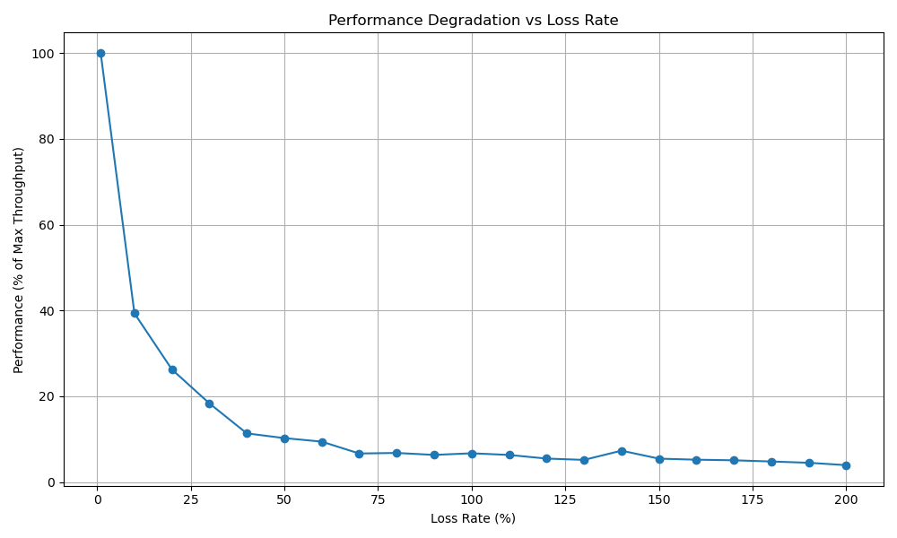
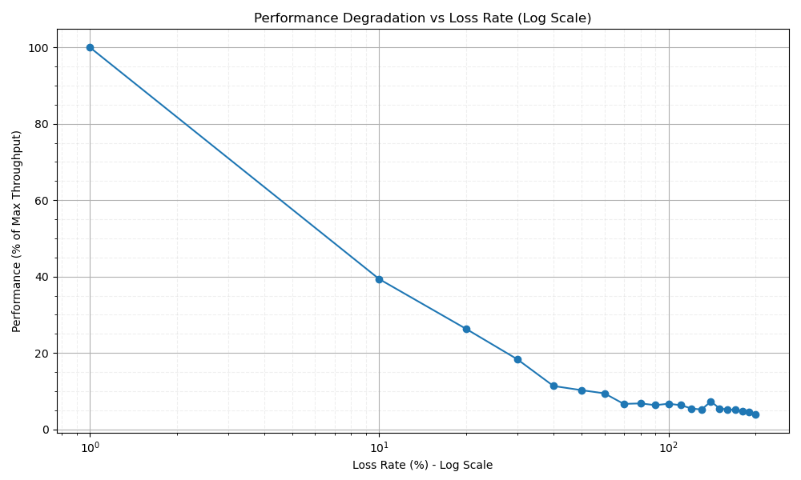

# Network Performance Testing with Mininet

This repository contains scripts for testing and analyzing the relationship between packet loss rate and network throughput using Mininet in a Docker environment. These experiments validate network performance models like the Mathis equation, demonstrating how even small packet loss rates can significantly impact throughput.

## Components

- `basic_topo.py`: Defines a simple network topology with one server and three worker nodes
- `simple_server.py`: Server implementation for measuring throughput
- `simple_worker.py`: Worker node implementation for sending data to the server
- `run_loss_test.py`: Automates testing across different packet loss rates
- `plot_results.py`: Generates visualizations of test results

## Setup Docker Environment

### Prerequisites

- Docker and Docker Compose
- Python 3.6+
- Required packages: numpy, pandas, matplotlib

### Starting the Docker Container

```bash
# Navigate to the mininet-docker directory
cd /path/to/mininet-docker

# Start the Docker container
docker-compose up -d

# Verify the container is running
docker ps
```

## Network Topology

The experiments use a simple star topology:

```
server --- switch --- worker1
              |
              |------ worker2
              |
              |------ worker3
```

- One server connected to a switch
- Three worker nodes connected to the same switch
- Each link has configurable bandwidth, delay, and packet loss rate

## Configuration Parameters

The following parameters can be configured for the experiments:

- **Bandwidth**: Default 100 Mbps
- **Delay**: Default 5ms
- **TCP Window Size**: 1MB (increased from default to better observe loss impact)
- **MTU**: 1500 bytes (standard Ethernet MTU)
- **Loss Rate Range**: Tests cover from 0.01% to 2.0%
- **Test Duration**: 15 seconds per test (configurable)
- **TCP Implementation**: Default Linux TCP implementation (CUBIC)

## Running Tests

### Automated Testing Across Loss Rates

```bash
# Run tests with specific parameters
python run_loss_test.py --bw 100 --delay 5ms --iterations 1
```

This runs a series of tests with different packet loss rates and collects the throughput results.

### Generating Visualizations

```bash
# Generate standard plot
python plot_results.py results_20250520_140640

# Generate logarithmic scale plot
python plot_results.py results_20250520_140640 --log
```

## Recent Results (140640 Folder)

Recent tests show a clear relationship between packet loss and throughput. **These results are obtained from actual network measurements using iperf, not theoretical calculations**. Each data point represents the average throughput measured when running TCP connections through links with precisely controlled packet loss rates:

| Loss Rate (%) | Performance (% of Max) | Degradation (%) |
| ------------- | ---------------------- | --------------- |
| 0.01          | 100.00                 | 0.00            |
| 0.1           | 39.33                  | 60.67           |
| 0.2           | 26.25                  | 73.75           |
| 0.3           | 18.34                  | 81.66           |
| 0.4           | 11.34                  | 88.66           |
| 0.5           | 10.24                  | 89.76           |
| 0.6           | 9.41                   | 90.59           |
| 0.7           | 6.64                   | 93.36           |
| 0.8           | 6.78                   | 93.22           |
| 0.9           | 6.32                   | 93.68           |
| 1.0           | 6.70                   | 93.30           |
| 1.5           | 5.44                   | 94.56           |
| 2.0           | 3.93                   | 96.07           |

### Measurement Methodology

The throughput measurements are conducted using actual iperf traffic between hosts in a Mininet-simulated network with precisely controlled link characteristics. Unlike theoretical calculations, these results capture the real TCP behavior when facing packet loss in a controlled environment.

Each test follows this process:

1. **Network Setup**: A network is created with configurable bandwidth, delay, and packet loss using Mininet's TCLink
2. **Traffic Generation**: Real TCP traffic is generated between hosts using the standard iperf tool
3. **Measurement**: Actual throughput is measured directly from iperf output
4. **Multiple Samples**: Each configuration is tested across multiple worker nodes to ensure reliability

```python
# From basic_topo.py - Network topology with configurable loss rate
class SimpleTopology(Topo):
    def build(self, bw=100, delay='1ms', loss=0):
        # Add hosts and switch
        server = self.addHost('server')
        worker1 = self.addHost('worker1')
        worker2 = self.addHost('worker2')
        worker3 = self.addHost('worker3')
        switch = self.addSwitch('s1')
        
        # Connect with specific link characteristics
        self.addLink(server, switch, bw=bw, delay=delay, loss=loss)
        self.addLink(worker1, switch, bw=bw, delay=delay, loss=loss)
        self.addLink(worker2, switch, bw=bw, delay=delay, loss=loss)
        self.addLink(worker3, switch, bw=bw, delay=delay, loss=loss)
```

```python
# From basic_topo.py - How each iperf test is conducted
def run_iperf_test(net, server, worker, duration=15):
    # Start the iperf server
    server.cmd('iperf -s &')
    time.sleep(2)
    
    # Run the client test with specified parameters
    result = worker.cmd(f'iperf -c {server.IP()} -t {duration} -i 1 -w 1M -M 1500')
    
    # Clean up the server process
    server.cmd('kill %iperf')
    
    return result
```

The results are collected and processed from actual iperf output:

```python
# From run_loss_test.py - How throughput is extracted from iperf output
def parse_iperf_output(output):
    lines = output.strip().split('\n')
    for line in reversed(lines):
        if 'Mbits/sec' in line:
            match = re.search(r'(\d+\.?\d*)\s+Mbits/sec', line)
            if match:
                return float(match.group(1))
    return 0.0
```

Sample raw output from an iperf test (0.1% loss rate):
```
------------------------------------------------------------
Client connecting to 10.0.0.1, TCP port 5001
TCP window size: 1.00 MByte, MTU: 1500
------------------------------------------------------------
[  3] local 10.0.0.2 port 58872 connected with 10.0.0.1 port 5001
[ ID] Interval       Transfer     Bandwidth
[  3]  0.0-15.0 sec  50.0 MBytes  26.4 Mbits/sec
```

### Visualization of Results

The dramatic impact of packet loss on throughput is clearly visible in these plots:

#### Linear Scale Plot


#### Logarithmic Scale Plot


The logarithmic scale plot particularly highlights how throughput degrades according to the inverse square root relationship predicted by the Mathis equation.

Key observations from these results:
1. Dramatic performance drop with just 0.1% packet loss (over 60% throughput reduction)
2. By 0.5% loss rate, throughput is reduced by nearly 90%
3. Loss rates of 1-2% result in throughput reduction of over 93%
4. The relationship closely follows the theoretical TCP performance models

These results validate that throughput degrades roughly proportional to 1/√p as predicted by the Mathis equation:

```
Throughput ≈ (MSS/RTT) * (1/sqrt(p))
```

where:

- MSS: Maximum Segment Size (typically 1460 bytes)
- RTT: Round-Trip Time
- p: Packet loss rate

## Theoretical Model vs. Experimental Results

Our experimental results closely match the theoretical predictions, showing that:

1. Even a small loss rate (0.1%) reduces throughput by over 60%
2. Loss rates of 1% or higher reduce throughput to less than 7% of maximum
3. The relationship follows a roughly inverse-square-root pattern

These findings have important implications for distributed systems that rely on network communication, such as distributed machine learning frameworks.
